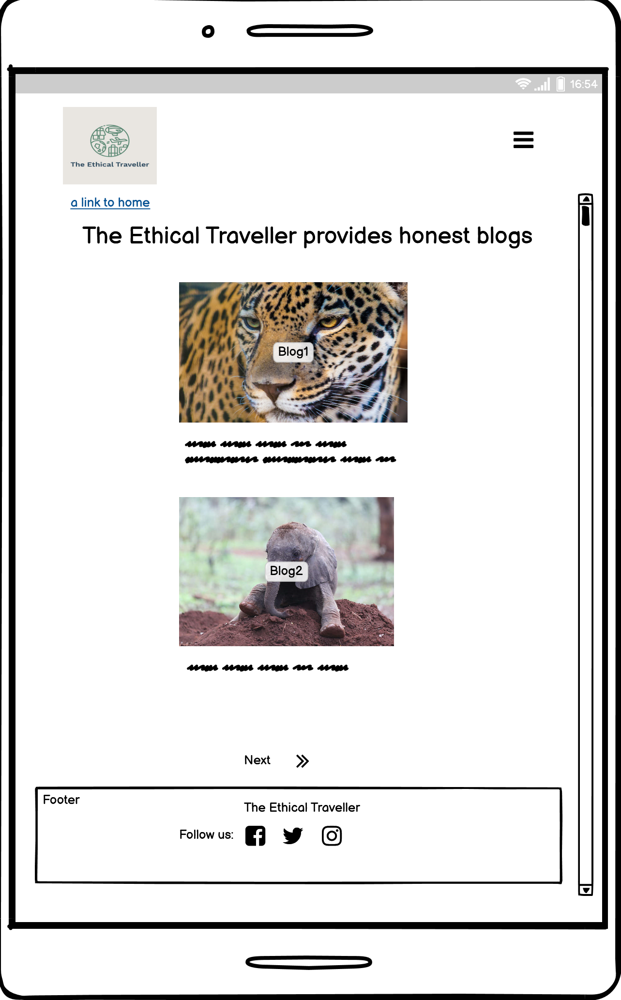

# The Ethical Traveller Blog Site

# Introduction
The Ethical Traveller provides a forum for users to write blogs about ethical travel as well as
conservation projects and volunteering programmes for like minded people.

It also provides volunteering holiday projects that users can book online.

The live website can be found [here](https://the-ethical-traveller.herokuapp.com/).

# Contents

-   [1. Use Experience (UX)](#ux)
    -  [1.1. Strategy](#strategy)
        -  [Project Objectives](#project-objectives)
        -  [Scope](#scope)
        -  [User Expectations](#user-expectations)
        -  [User Stories](#user-stories)
    -  [1.2. Structure](#structure)
    -  [1.3. Skeleton](#skeleton)
    -  [1.4. Surface](#surface)
-   [2. Features](#features)
-   [3. Technologies Used](#technologies-used)
-   [4. Testing](#testing)
-   [5. Production Cycle](#production-cycle)
-   [6. Deployment](#deployment)
-   [7. Credits](#credits)

# 1. User Experience (UX)
The site is aimed  at young adventurers who care about the environment, and who want to combine their free time with ethical adventure, where they feel they are contirbuting to the wellfare of the environment and want to share their experiences, stories and pictures, whilst still having fun.

[Go to the top](#contents)

## 1.1. Strategy
The project is being developed in phases, the first being the blog site and hosting of volunteering holidays for users to book. It is expected that the users will also use the blog app on this site to post their stories and photos from these holidays.

The site will further be developed, phase two, where it will provide a platform for charitable organisations to post specific projects for volunteers to sign up to. The organisations will be able to manage their own postings on this site.

[Go to the top](#contents)
 
### Project Objectives

The main objective of the current project is to make use of CRUD functionality (Create, Read, Update and Delete), where the user is able create, read, update and delete posts, and the site owner/administrator is able to add, update and delete holiday projects.
 

### Scope
#### Scope Features - for current project
-   Create an accessible website
-   The site will have a navbar and footer
-   The navbar will be simple and easy to navigate
-   The navbar will be responsive on smaller devices - collapsing and accessible via hamburger toggle button. 
-   The navbar will contain a responsive company logo, which will return the user to the home page.
-   The footer will contain responsive social media icons to take the user to the respective website.
-  The site will allow all visitors to read posts
- The site will allow all visitors to register/sign-up
- The site will allow registered users to log-in
- The site will only allow registered and signed in users to like and comment blogs
- The site will only allow registered and signed in users to create blogs
- The site will only allow registered and signed in users to edit and delete their own blogs
- The site will have a navigational button for taking users back to post listings page (blog page) from the post detail page
- The site will have a navigational button for taking users back to post detail page from the delete page if they have changed their mind about deleting the post.
- Success and alert messages will appear confirming user action 
### User Expectations
- The site should be easily navigable and intuitive. 
- The buttons and navbar links do what they are suppose to.
- The website is responsive on all devices.
- User action is confirmed with success messages and alerts

[Go to the top](#contents)
### User Stories
GitHub issues and project were utilised as an Agile development tool, a kanban board, to track the progress of the site. The site was built in small incremental stages, sprints, using 'user stories' - the user of the site and the site administrator. 

The MoSCoW - must have, should have, could have and won't have - prioritization method was used to categorise tasks and roadmap the development of the site (applicable to the holiday aspect of the site).

A wighted scoring according to ranking of importance to the functionality of the site for the purpose it was being built, has been allocated as in the below table. The score is from 5 - 1, 5 being the highest ranking in accordance with the importance to the business' functionality.
 

### Scoring/Ranking Table
Feature| Importance| Accomplished in this Iteration
------------ | -------------------------|---------
View post and holiday list | 5 | 5
Open a post and holiday for details | 5 | 5
Like/unlike posts | 4 | 4
Comment on posts | 4 | 4
User register and login | 5 | 5
Ability to add, update and delete post | 5 | 5
Responsive design | 5 | 5
Defensive coding | 5 | 5
Booking form | 5 | 5
Ability to create a holiday booking in the future | 5 | 5
Ability to select a holiday | 5 | 5
Ability to create a holiday by admin | 5 | 5
Ability to update and delete holiday by admin | 5 | 5

Total | 63 | 63

This project was a relatively small project, limited by time, but has potential for further development, incorporating phase two and requested tweaks by the site owner in the next iteration.

### User Stories Board and Sprints

 

 

 

 

## 1.2. Structure

[Go to the top](#table-of-contents)

The structure of the website is simple:

- Home page - the home page is the landing page for visitors, where it provides some information aboout what service the site provides. Taking future developments into consideration, this will become the hub for visitors.

- Blog page - is a category of the home page which provides the post listings. The post detail and add post are sub-categories. Edit and delete own posts are further sub-categories of the post detail.

- Register/sign-up, Log-in and Log-out are categories of the home page.

Site map illustraton (Miro Mind Map)

 
### Database structure
An Entity Relationship Diagram (ERD) has been created to better understand the database structure, which in turn has been converted into usable Django models (likened to tables in a database).

ERD Model structure

## 1.3. Skeleton

[Go to the top](#contents)

### Wire-frames
Wireframes, using Balsamiq, for desktop and mobile devices have been used as part of the planning process for the project.

Some of the wireframes shown below:

#### Landing Page Desktop:

 
 

#### Landing Page Mobile:

#### Blog Page Desktop:

#### Blog Page Mobile:

#### Blog Detail Desktop:

#### Blog Detail Mobile:

#### Add Blog Desktop:

#### Add Blog Mobile:

## 1.4. Surface
[Go to the top](#contents)

The website provides a simple visual effect with contrast, to prevent the user being distracted.

### Colour
The colour palette chosen for this project was inspired by a forest scene, which has complimentray hues of green and stone, not too disimilar to the hero image on the landing page.

##### Colour palette

Sitting in the middle of the spectrum, green is the color of balance, which represents nature, health and freshness, and is most associated with 'ecoism'. Green is also considered to be calming and restful.

### Logo
The logo was created using Wix Logo Maker. The above colour palette was used for the colours of the logo.
  

#### Logo

  

### Fonts

The font, Roboto and Lato, have been used which has provided simplicity to the website and legibility, especially to large blocks of text.

# 2. Features

[Go to the top](#contents)

### Navbar
The navbar is the same on all pages, and provides a responsive logo which takes you back to the home page. The navigation list collapses for smaller devices and can be viewed by clicking on a 'hamburger' toggle button.

The navbar only provides navigation to the Blog page, Register page and Login page, when the user first lands on the website.

Once the user has signed-up or logged-in, then the navbar changes to provide an Add Blog page and a Logout page. The Register and Login pages disappear.
 

#### Collapsed navbar

The footer appears on all pages and has responsive social media icons, which, when clicked, take you to their respective websites.

The logo, which is located within the navbar, is fully responsive and provides the user a link to the home page from whereever they are on the site. 
### Register Page

The Register page is simple signup form, taken from Django allauth, that requires user input. If the user is already signed up and tries again, he/she will be alerted that 'A user with that username already exists'. If the required fields are left blank, then the user will be prompted to fill in the fields.

### Login & Logout Page
The login page, again was taken from Django allauth, is a simple form that requires user input. If data is omitted from the required fields, the user is prompted to fill them in. After the user logs in a success message flashes up confirming the successful login.

The logout page is extremely simple - it enquires if the user is sure that they want to sign out and has a sign out button. Upon signing out the user receives a confirmation of suceesfully signing out.

### Commenting & Likes

Users can only comment and like posts if they are registered and logged in. They are not given the opportunity to comment or like if they have not signed-in.

### Edit & Deleting Posts
The user is only permitted to edit or delete their own posts. If they attempt to either edit or delete someone elses post a message will be displayed telling them that they not the author of the post and therefore not permitted to edit or delete the post.

The back buttons take you back to the previous page.
### Add Blog Page
The user is only able to add a blog once registed and signed-in. The form is fairly simple and intuitive. 

The images, once uploaded, are stored in Cloudinary.

The slug field, although not visible, is still activate in the background to provide a unique value to the post, and is the slugification of the title.

  

### Holiday Pages Features

On the holiday booking form has selection fields with dropdown menus for the holiday and duration of the holiday. The date field provides a date picker. This field prevents the user choosing today's date or a date in the past.

The CRUD functionality for creating, updating and deleting holidays to the site frontend is restricted to the siteowner/administrator.

The edit and delete buttons will only appear when the admin (supersuer) is logged in.

  

# 3. Technologies Used

[Go to the top](#contents)

-   HTML5 - basic structure of the site
-   CSS3 - style to the site
-   JavaScript - small amount to provide a time set to some of the success messages.
-   Python - backend functionality
-   Boostrap - inline styling and icons
-   Django library and templates
-   PostgreSQL - data storage (databases)
-   Gitpod - version control
-   Balsamiq - wireframes
-   Google Fonts - font style
-   GitHub - repository
-   Cloudinary - image storage
-   Miro - mind map to map site structure
-   Wix Logo Maker - logo
-   Heroku - host provider

# 4. Testing

[Go to the top](#contents)

#### Lighthouse & Sitemprove

Lighthouse and Siteimprove were used to check the accessibility of the site.

#### Siteimprove

#### Lighthouse Desktop

#### Lighthouse Mobile

W3C Markup was used to check for errors in the HTML (Templates) pages. The files incorporated Django templates, so it would have been difficult to get any meaningful results if raw code had been tested. I used inspect source on the site, copied the full HTML and ran it through the validator.

#### Post Detail

These errors are being caused by the formatting of the text content within the post, rather than the code.

#### Update Post

These errors are being caused by the formatting of the text content within the post, rather than the code.

The CSS Code was checked through W£C CSS (jigsaw)

Java Script was tested via JSHint

Under normal circumstances, Python would have been validated via PEP8 Online, but the site was down and could not be used. The code was, therefore validated by installing pycodestyle, which highlighted any errors.

The various issues that came to light during the validation process were dealt with. A chart below shows the final outcome.

## Manual Testing
The site has been tested in the following browsers, without any problems:

- Google Chrome
- Firefox
- Microsoft Edge

It has also been tested on these devices:
-   Samsung J6
-   Surface Pro
-   Kindle Fire Tablet

The responsiveness was also tested in dev tools different device sizes, without problems. 

The site features were tested as per the following table:

### Navigation Bar

All Pages:
TEST            | OUTCOME                          | PASS / FAIL  
--------------- | -------------------------------- | ---------------
Home page | When clicking the "home" link or the logo in the navigation bar, the browser redirects me to the home page. | PASS
Blog page | When clicking the "blog" link in the navigation bar, the browser redirects me to the blog page. | PASS
Volunteering Holiday page | When clicking the "volunteering holiday" link in the navigation bar, the browser redirects me to the volunteering holiday page. | PASS
Add Blog page | When clicking the "add blog" link in the navigation bar, the browser redirects me to the add your post form page. The user will know they are on this page by the heading. | PASS
Add Holiday page | When clicking the "add holiday" link in the navigation bar (which only appears when the admin is logged in), the browser redirects me to the add holiday/project form page. The administrator will know they are on this page by the heading.| PASS
Register page | When clicking the "register" link in the navigation bar, the browser redirects me to the register page. The user will know they are on this page by the heading. | PASS
Login / Logout pages | When clicking the "login/logout" links in the navigation bar, the browser redirects me to the login or logout page. The user will know they are on this page by the heading. | PASS
Foreground & background colour | Checked for contrast and clarity | PASS

### Footer
TEST            | OUTCOME                          | PASS / FAIL  
--------------- | -------------------------------- | ---------------
Facebook | When clicking the Facebook icon, a new tab opens and redirects to the Facebook website. | PASS
Twitter | When clicking the Twitter icon, a new tab opens and redirects to the Twitter website. | PASS
Instagram | When clicking the Instagram icon, a new tab opens and redirects to the Instagram website. | PASS
Youtube | When clicking the Youtube icon, a new tab opens and redirects to the Youtube website. | PASS

### Features
TEST            | OUTCOME                          | PASS / FAIL  
--------------- | -------------------------------- | ---------------
Booking button | When clicking the "book" button in holiday detail, the browser directs me to the booking form. Only allows this once logged in | PASS
Booking form | When sclicking on the "select holiday" and "select duration of holiday" fields a dropdown menu appears. When clicking on the "select booking date" field a date picker appears - this field will not allow dates to be selected in the past or current day - a validaion error message appears. If the fields aren't selected the form will not submit and message appears to complete the fields. On submission of booking form a success message appears. | PASS
Add Holiday | Only available to logged in admin frontend. On entering the fields and uploading images, and submitting. Sucess message appears and entry added to products database and holiday listing frontend. | FAIL *
Update/Delete Holiday | Only available to logged in admin frontend. On updating fields and submitting form, entry is updated successfully and success message appears. When clicking on "delete" button I am directed to delete holiday/project page where a warning appears making sure that the user wants to delete the entry. If yes, the entry simply disappears. The user is given the option of using a back button to take them to the previous page (this is also true of the the blog posts). | PASS

 *The failed test for adding holidays does not render the image on submission. However if the same entry is edited and an image chosen again, then the updated holiday renders successfully. Unfortunately, I have been unable to find the cause of this bug, but believe it may have something to do with a path issue to successfully upload images to storage at Cloudinary.

# 5. Production Cycle

[Go to the top](#contents)

### Project Checklist
- Install Django and the supporting libraries
    -  Install Django and Gunicorn (used to run project on Heroku)
    - Install support libraries psycopg2 (PostgreSQL) and Cloudinary (for storage of images)
    - Create the requirements.txt file (includes project's dependencies enabling the running of the project on Heroku)

### Pre-Production Deployment
- Create a blank Django Project
    - Create a new project
    - Create the app
    - Add blog to the installed apps in settings.py
    - Migrate all new changes to the database
    - Run the server to test

- Setup project to use Cloudinary and PostgreSQL
    - Create new Heroku app
        - Select New
        - Select create new app
        - Enter a relevant app name
        - Select appropriate region
        - Select the create app button

    - Attach PostgreSQL database
        - In Heroku go to resources
        - Search for Postgres in the add-ons box
        - Select Heroku Postgres
        - Submit order form

    - Prepare the environment and settings.py file
        - Create env.py file
        - Add DATABASE_URL with the Postgres URL from Heroku
        - Add SECRET_KEY with a randomly generated key
        - Add SECRET_KEY and generated key to the config vars in Heroku
        - Add if statement to settings.py to prevent the production server from erroring
        - Replace insecure key with the environment variable for the SECRET_KEY
        - Add Heroku database as the back end
        - Migrate changes to new database

    - Static media files stored on Cloudinary
        - From the Cloudinary dashboard, copy the API Environment variable
        - In the settings.py file create a new environment variable for CLOUDINARY_URL
        - Add the CLOUDINARY_URL variable to Heroku
        - Add a temporary config var for DISABLE_COLLECTSTATIC
        - In settings.py add Cloudinary as an installed app
        - Add static and media file variables
        - Add templates directory
        - Change DIR's key to point to TEMPALTES_DIR
        - Add Heroku hostname to allowed hosts
        - Create directories for media, static and templates in the project workspace
        - Create a Procfile

- Deploy empty project to Heroku

# 6. Deployment

[Go to the top](#contents)

- Set debug = False in my settings.py file. This prevents Django giving verbose error pages with traceback, which reveals a lot about the code and is open to attackers 
- Add below debug = False: X_FRAME_OPTIONS = "SAMEORGIN". This enables the Summernote editor to work when the project is deployed.
- Save all files, commit and push to GitHub
- In Heroku, remove the DISABLE_COLLECTSTATIC config var.
- In the deploy tab, go to the manual deploy sections and click deploy branch.

I initially had a problem with deployment, which was resolved by adding a runtime.txt file and noting a version of python-3.9.14, which declared to Heroku the version of python it should use. I also had to re-copy the config vars from Heroku into my project as they had changed.

# 7. Credits

[Go to the top](#contents)

Some of the free images were taken from Adobe Stock and Pixel. Some have been taken from various holiday sites, but because this site has been built for educational purposes and is not meant to be a money making business, this is permitted under copyright law. I have also added a disclaimer - frontend in the footer section of the website.

For the base of my project I referred to and used some code from the Code Institute walk along project as a template

I obtained assistance from the Slack Community, Stack overflow and Code Institute Tutor Support

I also used the internet to search for answers to coding problems or parralel logic.

My Mentor, Marcel Mulder for his guidance and support